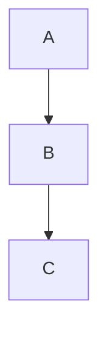

# pandoc-mermaid-rs-renderer

A Pandoc Lua filter and Docker setup for rendering Mermaid diagrams using
[mmdr](https://github.com/1jehuang/mermaid-rs-renderer) (mermaid-rs-renderer),
a Rust-based Mermaid renderer.

Unlike [mermaid-filter](https://github.com/raghur/mermaid-filter) or
[mermaid-cli](https://github.com/mermaid-js/mermaid-cli), this approach
requires **no Chromium and no Node.js**. Diagrams are rendered directly to
SVG or PNG by a native binary, making builds significantly faster and lighter.

## Quick Start (Docker)

Build the Docker image and generate the example PDF:

```sh
make example
```

This builds a Docker image containing Pandoc, xelatex, and mmdr, then
renders `examples/example.md` (which includes several Mermaid diagrams)
to `examples/example.pdf`.

## Usage

### With Docker (recommended)

1. **Build the image:**

   ```sh
   make build
   ```

   Or directly:

   ```sh
   docker build --target pandoc-mmdr -t pandoc-mmdr .
   ```

2. **Convert a document:**

   ```sh
   docker run --rm -v "$(pwd):/data" -u $(id -u):$(id -g) pandoc-mmdr \
       --lua-filter mermaid-mmdr.lua \
       --pdf-engine=xelatex \
       input.md -o output.pdf
   ```

   The filter is pre-installed in the image at
   `/usr/local/share/pandoc/filters/mermaid-mmdr.lua`, so Pandoc finds it
   by name.

   For nicer PDFs, add the eisvogel template and a table of contents:

   ```sh
   docker run --rm -v "$(pwd):/data" -u $(id -u):$(id -g) pandoc-mmdr \
       --template eisvogel \
       --toc --toc-depth=2 \
       --pdf-engine=xelatex \
       --lua-filter mermaid-mmdr.lua \
       input.md -o output.pdf
   ```

### Without Docker (manual installation)

If you prefer to run Pandoc natively:

1. **Install mmdr:**

   ```sh
   cargo install mermaid-rs-renderer
   ```

   This requires Rust 1.87 or later. The binary will be installed as `mmdr`.

2. **Copy the filter** into your Pandoc filters directory, or reference it
   by path:

   ```sh
   pandoc --lua-filter ./mermaid-mmdr.lua \
       --pdf-engine=xelatex \
       input.md -o output.pdf
   ```

3. **(Optional) Create a config file** for mmdr to control theme colors
   and fonts, and point the filter to it:

   ```sh
   export MMDR_CONFIG=/path/to/your/config.json
   ```

   See the `Dockerfile` for an example config.

## How It Works

The Lua filter (`mermaid-mmdr.lua`) intercepts fenced code blocks with the
`mermaid` class:

````markdown

````

For each block, it:

1. Hashes the diagram source for caching (repeated identical diagrams are
   rendered only once).
2. Writes the Mermaid source to a temp file.
3. Calls `mmdr -i input.mmd -o output.svg -e svg` to render it (or `-e png`
   if PNG format is selected).
4. Replaces the code block with an image element pointing at the rendered file.

### Captions, Alt Text, and Format

You can set captions, alt text, and output format via code block attributes:

````markdown
```{.mermaid caption="System architecture" alt="Architecture diagram"}
graph LR
    A --> B --> C
```
````

To render a specific diagram as PNG instead of the default SVG:

````markdown
```{.mermaid format="png"}
graph LR
    A --> B --> C
```
````

## Configuration

### Environment Variables

| Variable | Default | Description |
|---|---|---|
| `MERMAID_CACHE_DIR` | `/tmp/mermaid-cache` | Directory for cached rendered diagrams |
| `MERMAID_FORMAT` | `svg` | Default output format: `svg` or `png` |
| `MMDR_CONFIG` | (none) | Path to mmdr JSON config for theme/font settings |

### mmdr Config

The Docker image includes a default config at `/usr/share/mmdr/config.json`
with sensible colors and fonts. To customize, create your own config file:

```json
{
  "themeVariables": {
    "primaryColor": "#F8FAFF",
    "primaryTextColor": "#1C2430",
    "primaryBorderColor": "#C7D2E5",
    "lineColor": "#7A8AA6",
    "fontFamily": "DejaVu Sans, sans-serif",
    "fontSize": 13
  },
  "flowchart": {
    "nodeSpacing": 50,
    "rankSpacing": 50
  }
}
```

Mount it into the container or set `MMDR_CONFIG` to point to it.

## What's in the Docker Image

The image is built in two stages:

1. **Build stage** (`rust:1.93-alpine`): compiles mmdr from source via
   `cargo install mermaid-rs-renderer`.
2. **Runtime stage** (`pandoc/extra:3.8.0`): includes Pandoc, xelatex,
   the eisvogel template, TeX Live fonts, the mmdr binary, and the Lua
   filter.

The final image includes:
- Pandoc 3.8.0
- xelatex (TeX Live)
- mmdr 0.1.2
- The eisvogel template (from `pandoc/extra`)
- Source Sans Pro and Source Code Pro fonts
- LaTeX `svg` package for native SVG embedding
- The `mermaid-mmdr.lua` filter

## Known Limitations (mmdr 0.1.2)

mmdr 0.1.2 has a bug in its graph layout engine (`dagre_rust`) that causes
crashes on diagrams with **edge labels**. This affects:

- **Flowcharts** with edge labels (`-->|label|`) or diamond nodes (`{decision}`)
- **State diagrams** (edge labels like `-->: event`)
- **ER diagrams** (relationship labels)

Flowcharts without edge labels, sequence diagrams, class diagrams, Gantt
charts, pie charts, journey maps, mindmaps, and git graphs all work.

The filter handles these crashes gracefully -- failed diagrams are replaced
with an error code block in the output rather than aborting the build. This
is an upstream issue in mmdr and will likely be fixed in a future release.

## Repository Structure

```
.
├── Dockerfile          # Multi-stage build for pandoc + mmdr
├── Makefile            # Build image and generate example PDF
├── mermaid-mmdr.lua    # Pandoc Lua filter (the core of this project)
└── examples/
    ├── example.md      # Sample document with Mermaid diagrams
    └── example.pdf     # Pre-built PDF output
```

## Authors

- claude / claude-flow
- Oskar Stenman

## License

MIT
