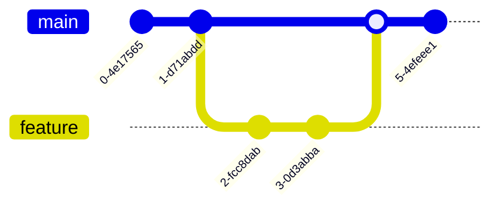

# Introduction

This document demonstrates rendering Mermaid diagrams in Pandoc using
[mmdr](https://github.com/1jehuang/mermaid-rs-renderer), a fast
Rust-based Mermaid renderer that requires no Chromium or Node.js.

# Flowchart

A simple processing pipeline:

# Sequence Diagram

A request/response sequence:

# Class Diagram

A simple class hierarchy:

# Gantt Chart

A project timeline:

# Pie Chart

Distribution of languages in a project:

# Journey

A user experience journey:

# Mindmap

A topic breakdown:

# Git Graph

A branching workflow:

# Conclusion

All diagrams above were rendered at build time by `mmdr` and
embedded directly into the output. No browser engine was involved.
